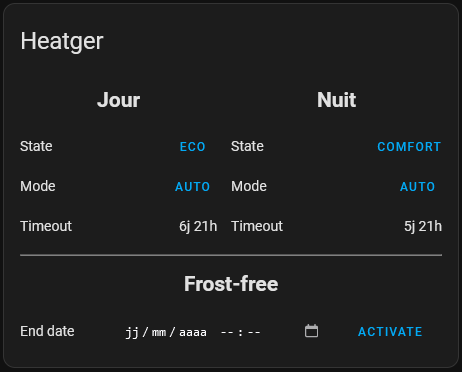

# Heatger
Heatger is a heating manager for raspberry pi, you can use a raspberry zeroW.

features include : 
 - up to 3 zones
 - wait for ip found on network to return to comfort mode
 - use mqtt to communicate with home assistant
 - electric meter input to track heating consumption
 - I2C for physical user interface(under development)
 - custom card for home assistant
 - custom panel for home assistant(coming soon)

### table of contents
- **[Install](#install)**
- **[setting up config.json](#setting-up-configjson)**
  - **[Mqtt](#mqtt)**
  - **[Network](#network)**
  - **[I2C](#i2c)**
  - **[Input](#input)**
  - **[Zone](#zone)**
- **[custom card for home assistant](#heatger-card)**
  - **[Install](#install-1)**
  - **[use](#use)**
- **[custom panel for home assistant(soon)](#heatger-panel)**

# Install
```shell
sudo apt-get update && sudo apt-get upgrade -y
sudo apt-get install git -y
git clone https://github.com/kevin-briand/heatger.git
cd heatger
sudo chmod +x INSTALL.sh && ./INSTALL.sh
```

# setting up config.json
### mqtt
You will need to provide your MQTT broker credentials.
```json

{
  "mqtt": {
    "enabled": false,
    "host":"broker_ip",
    "port":1883,
    "username":"broker_username",
    "password":"broker_password"
  }
}
```
---
### network
This option allows you to enable network control and specify the IP address to use for the ping.
```json

{
  "network": {
    "enabled": false,
    "ip": [
      "ip1",
      "ip2"
    ]
  }
}
```
---
### I2C
This option is used to enable the I2C protocol for :
 - screen(type sh1106, OLED)
 - temperature(type bme280)
 - io(type PCF8574)
```json

{
  "i2c": {
    "temperature": {
      "enabled": false
    },
    "screen": {
      "enabled": false
    },
    "io": {
      "enabled": false
    }
  }
}
```
---
### input
This option is for enabling input :
 - electric_meter :
    - Enable if you want to track an electric meter(1 impulse = 1wh)
    - set gpio_input number where is wiring electric meter
```json

{
  "entry": {
    "electric_meter": {
      "enabled": false,
      "gpio_input": 23
    }
  }
}
```
---
### zone
This option defines the zone, you can set up a maximum of 3 zones (2 by default).

parameters :
 - name : display name
 - enabled : enable clock
 - gpio_eco : GPIO number where is wiring eco relay
 - gpio_frostfree : GPIO number where is wiring frost-free relay
 - prog : list of progs

```json

{
  "zone1": {
    "name": "",
    "enabled": true,
    "gpio_eco": 17,
    "gpio_frostfree": 18,
    "prog": []
  }
}
```
 Prog object :
 - day: day of the week between 0(monday) and 6(sunday)
 - hour: hour of the day
 - order: send order(0=comfort, 1=eco)
```json
{
  "day": 3,
  "hour": "12:48:00",
  "order": 1
}
```

# heatger card

## Install
To install the custom heatger card in the home assistant, you need to copy heatger-card.js in the frontend folder to the /config/www/ folder in the home assistant (you can use the file editor in the home assistant).

Then add this card to the resources path: https://developers.home-assistant.io/docs/frontend/custom-ui/registering-resources/

restart home assistant

To finish adding the custom card to your panel, select manual and type :
```yaml
type: custom:heatger-card
```

## use
### toggle state/mode
You can click on the mode/state buttons to change the mode/state(mode: auto<>manual, state: comfort<>eco).
### activate/deactivate frost-free
To activate frost-free, select the end date and click Activate.
when the frost-free is activated, the remaining time to the end is displayed and you can click on the stop button to stop the frost-free.

# heatger panel
Coming soon